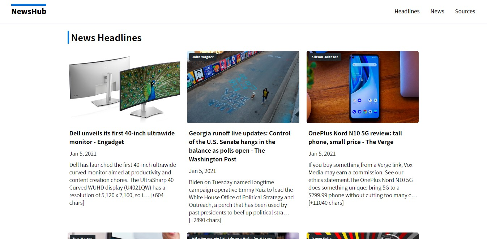

<!-- WEBSITE NAME -->
# NewsHub

<!-- WEBSITE SCREENSHOT -->


<!-- ABOUT THE PROJECT -->
### About The Project

**NewsHub** is a simple frontend website using newsapi api for backend.

### Built With

* [Vue.js](https://vuejs.org)
* SASS

<!-- GETTING STARTED -->
### Getting Started

To get started setting up your project locally. To get a local copy up and running follow these simple steps.

### Prerequisites
Assuming you have already installed latest node.js, npm, and git on your computer

### Installation

1. Clone the repo
   ```sh
   git clone https://github.com/wickeddd3/NewsHub.git
   ```
2. Install NPM packages
   ```sh
   npm install
   ```
3. Under src/api folder create a copy of env.example.js and rename it to env.js
4. Visit https://newsapi.org/ and create your account and generate your apiKey.
5. Fill up apiDomain = https://newsapi.org and apiKey = 'your newsapi api key'
6. Run locally
   ```sh
   npm run serve
   ```

<!-- CONTRIBUTING -->
### Contributing

Contributions are what make the open source community such an amazing place to be learn, inspire, and create. Any contributions you make are **greatly appreciated**.

1. Fork the Project
2. Create your Feature Branch (`git checkout -b feature/AmazingFeature`)
3. Commit your Changes (`git commit -m 'Add some AmazingFeature'`)
4. Push to the Branch (`git push origin feature/AmazingFeature`)
5. Open a Pull Request

<!-- CONTACT -->
### Contact

Philip - [https://www.linkedin.com/in/philip-andrew-pablo-501203180/](https://www.linkedin.com/in/philip-andrew-pablo-501203180/)

Project Link: [https://github.com/wickeddd3](https://github.com/wickeddd3)